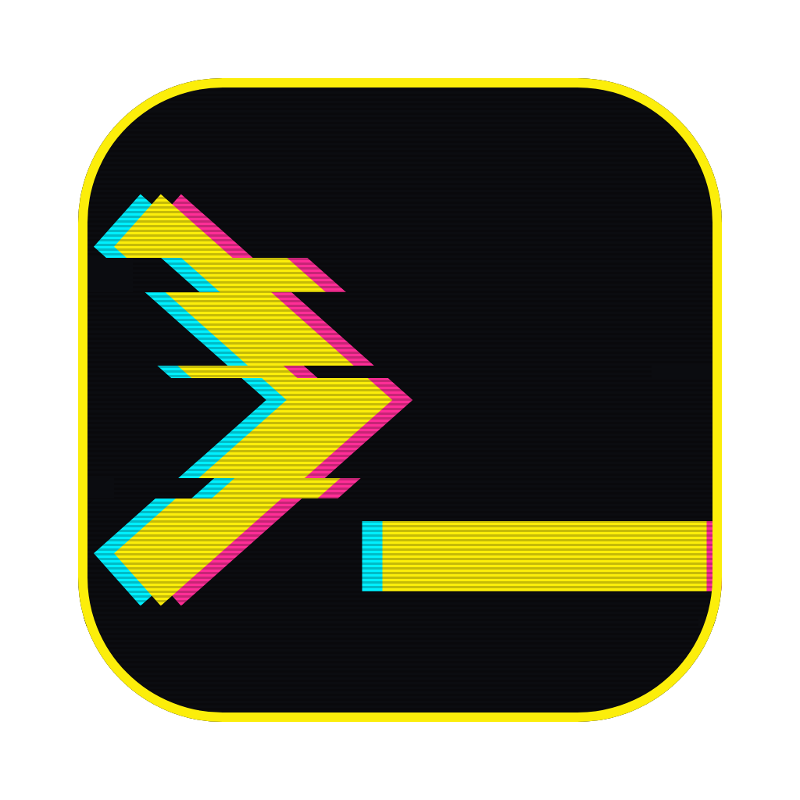

<!-- add screenshots/hero.png and uncomment:

-->

```
 ██████╗ ██╗  ██╗ ██████╗ ███████╗████████╗████████╗██╗   ██╗
██╔════╝ ██║  ██║██╔═══██╗██╔════╝╚══██╔══╝╚══██╔══╝╚██╗ ██╔╝
██║  ███╗███████║██║   ██║███████╗   ██║      ██║    ╚████╔╝
██║   ██║██╔══██║██║   ██║╚════██║   ██║      ██║     ╚██╔╝
╚██████╔╝██║  ██║╚██████╔╝███████║   ██║      ██║      ██║
 ╚═════╝ ╚═╝  ╚═╝ ╚═════╝ ╚══════╝   ╚═╝      ╚═╝      ╚═╝
▓▒░░▒▓█ C ¥ B Ξ R P U N K   T E R M 1 N A L █▓▒░░▒▓░▒▓▒░▒▓░▒
```

<p align="center">
  
  
  
  <a href="LICENSE"></a>
</p>

**A Cyberpunk 2077-style terminal for macOS, built on [Ghostty](https://ghostty.org).** Neon yellow, cyan, and magenta. A live CRT shader that glitches when you least expect it. A scrambled-text decode on every window you open. And to anyone shoulder-surfing you at the coffee shop — it's just Terminal.app. Nobody has to know.

<p align="center">
  
</p>

## ▓▓ 01 // BOOT SEQUENCE ▓▓

This is what jacking in looks like:

```
> INITIALIZING GHOSTTY-CYBERPUNK ..................... [ OK ]
> LOADING SHADER :: cyberpunk.glsl v3 ................ [ OK ]
> SCANLINES ── ABERRATION ── VIGNETTE ── GRAIN ....... [ OK ]
> ARMING GLITCH SCHEDULER :: 7 MODES ................. [ OK ]
> PROMPT UPLINK :: starship ▶ ........................ [ OK ]
> DISGUISE PROTOCOL :: "Terminal" .................... [ OK ]

// ACCESS GRANTED :: WELCOME TO NIGHT CITY
```

Every new window opens with a randomized banner that decodes itself out of static — `// LINK ESTABLISHED`, `// ACCESS GRANTED`, `// UPLINK SYNCED` — in about a third of a second, whatever the length.

## ▓▓ 02 // INSTALLED WETWARE ▓▓

- **CRT glitch shader** (`shaders/cyberpunk.glsl`) — always-on scanlines, chromatic aberration, vignette, film grain, and a slow signal roll. On top of that, a scheduler rolls the dice every half-second and can fire one of **7 glitch modes**: horizontal band tear, RGB split spike, block displacement, vertical sync jitter, brightness flicker, glyph color corruption, and a rare full-frame invert flash. Frequency, intensity, and duration are all randomized — it never loops.
- **`decode`** — the scrambled-text reveal as a command. `decode "ACCESS GRANTED"` animates any text.
- **`cprun`** — wraps any command in the fiction: `cprun make -j8` prints `// EXECUTING :: make -j8`, runs it, then `// COMPLETE :: 0 :: 4.2s` in green — or `// FAILED` in red with the exit code.
- **Starship prompt** — yellow → cyan powerline segments with path and git status, a magenta clock pinned hard to the right edge, and a `▶` cursor that flips red when the last command flatlined.
- **Themed `ls` colors** — dirs yellow, executables green, media magenta, archives red, docs blue. Uses [eza](https://github.com/eza-community/eza) if you have it, degrades cleanly to stock macOS `ls` if you don't.
- **ssh that just works** — remote hosts don't know Ghostty's terminfo and will whine about it. A tiny wrapper sends `TERM=xterm-256color` to remotes only; your local TERM stays untouched.
- **The disguise** — window title reads `Terminal`, and the Dock icon is swapped for one of three original icons (Mono / Window / Hazard) that pass for a stock system utility. Corpo-grade plausible deniability.

## ▓▓ 03 // RIG REQUIREMENTS ▓▓

Minimum spec to run this ICE:

- macOS on Apple Silicon
- [Homebrew](https://brew.sh) — the installer uses it to pull:
  - [Ghostty](https://ghostty.org)
  - FiraCode Nerd Font
  - [Starship](https://starship.rs)
- zsh (the macOS default — you already have it)
- Optional chrome: `eza` for the full ls color treatment

## ▓▓ 04 // JACK IN ▓▓

Three commands. Thirty seconds. Copy-paste as-is:

```sh
git clone https://github.com/BustaChimes/ghostty-cyberpunk.git
cd ghostty-cyberpunk
./install.sh
```

The installer checks dependencies, copies everything into `~/.config/ghostty/` and `~/.config/starship.toml`, adds three guarded lines to your `~/.zshrc`, and applies the icon. It is **idempotent** — safe to re-run — and any config it overwrites is backed up first as `<file>.pre-cyberpunk`.

Then open a new Ghostty window. `// ACCESS GRANTED`.

### > ./flatline (uninstall)

```sh
./uninstall.sh
```

Restores your backups, strips the zshrc lines, resets the icon. Like it never happened.

## ▓▓ 05 // TUNING THE ICE ▓▓

**Shader tunables** live at the top of `~/.config/ghostty/shaders/cyberpunk.glsl`:

| Constant | What it does |
|---|---|
| `GLITCH_CHANCE` | odds of a glitch per half-second window (default `0.08` — raise it if you want chaos) |
| `SCANLINE_STRENGTH` | how visible the CRT scanlines are (default `0.12`) |
| `INVERT_SHARE` | fraction of glitches upgraded to the full-frame invert flash (default `0.10`) |
| `ABERRATION_PX` / `VIGNETTE` / `GRAIN` | color fringe, edge darkening, noise floor |

Edit, then hit `Cmd+Shift+,` to reload Ghostty's config. Instant feedback.

**Icon** — three variants ship in `icons/`. Swap anytime:

```sh
~/.config/ghostty/apply-icon.sh Window.png   # or Mono.png / Hazard.png
```

**Banner** — set `DECODE_BANNER=0` in your environment to open windows in silence. `DECODE_COLOR` overrides the decode color:

```sh
DECODE_COLOR=$'\e[38;2;0;240;255m' decode "hello, choom"
```

## ▓▓ 06 // CORPO LEGAL ▓▓

> **Plain-language disclaimer, no lore:** this is a fan-made theme inspired by the *Cyberpunk 2077* aesthetic. It is **not affiliated with, endorsed by, or connected to CD Projekt Red** in any way. No CDPR assets are used — the icons are original artwork, and the colors are just colors.

MIT licensed — see [LICENSE](LICENSE). Now go make some noise, netrunner.
